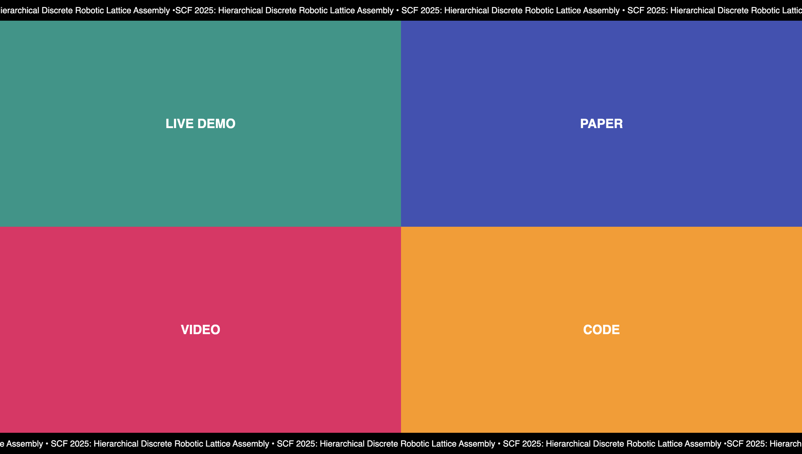

**Hierarchical Discrete Lattice Assembly:** An Approach for the Digital Fabrication of Mesoscale Structures

--- CLICK ON IMAGE TO OPEN WEBSITE ---

--- CLICK ON IMAGE TO OPEN WEBSITE ---

This is the code repository for the paper **"Hierarchical Discrete Lattice Assembly: An Approach for the Digital Fabrication of Scalable Macroscale Structures"**.

This repository implements the full simulation and planning pipeline described in the paper, including voxelization, motion planning, and robotic assembly of mesoscale lattice structures.

---

---

For questions or replication details, please refer to the paper or contact the authors.
